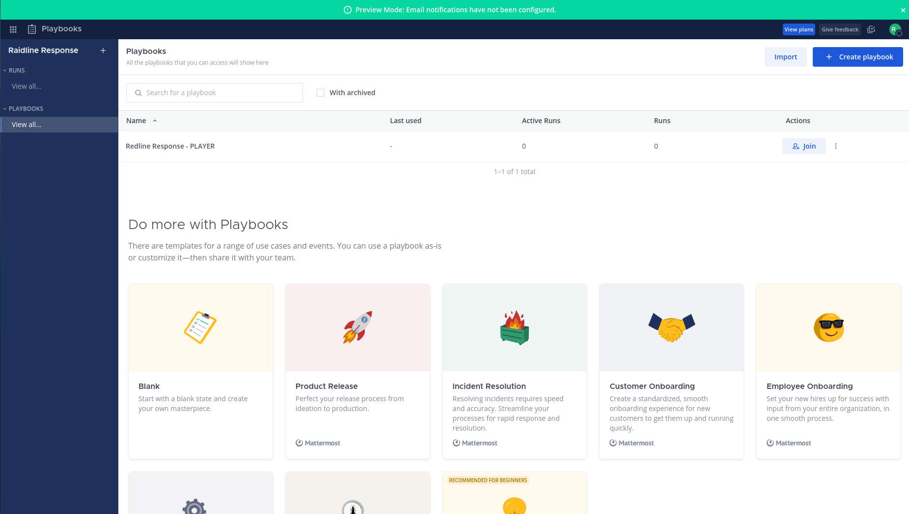
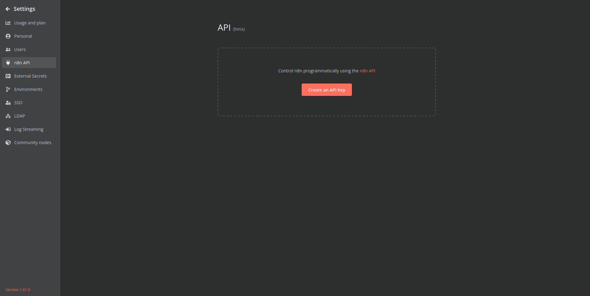

# Raidline on Linux / MacOS

 

RAIdline is a gaming platform to practice your Incident Response skills, leveraging Mattermost, n8n automation and LLMs to create and have you play interactive scenario !

## Prerequsites

You should make sure to have the following installed on your machine beforehand:
* Docker (https://docs.docker.com/desktop/install/mac-install/ or https://docs.docker.com/desktop/install/linux/)
* Ollama (https://ollama.com/)
    * With Gemma2 (ollama run gemma2) and Llama3 (ollama run llama3) models running
* jq (https://jqlang.github.io/jq/)

## Install Raidline from scratch

Clone the repo from github.

Navigate to the `scripts` directory.

Then ensure the install and check files are executable :

```
chmod +x setup_raidline_response.sh

chmod +x check_all_is_good.sh
```

And then perform controls and initial setup with check_all_is_good.sh script to ensure that everything seems to be in place :

```
./check_all_is_good.sh
```

This will create a .env file with adhoc credentials.

and finally execute the shell file in the same directory :

```
./setup_raidline_response.sh
```

## Launch Raidline to validate install

Open you browser and connect to :

### Mattermost
You can go to you local mattermost instance :
* http://localhost:8065/login 

and test the login and password setup in the .ENV file.

Then you can check if the playbook template Raidline Response exist, and join it:




### N8N 

You can find the local instance here:
http://localhost:5678/setup

Start by creating your user.

#### Credentials and Workflows
You should see the workflows and credentials in you home page, in the corresponding tabs.


* Ollama :

If the credential is not recognized by n8n (for Ollama on Linux for instance) :
You might have to replace the host/IP (e.g. 172.17.0.1).
You can check it with the following command: 
```
ip addr show | grep "\binet\b.*\bdocker0\b" | awk '{print $2}' | cut -d '/' -f 1
```

If you're using custom port (different from 11434), you might want to change it here as well.

Please check this FAQ out on [Ollama Github](https://github.com/ollama/ollama/blob/main/docs/faq.md)

* N8N :

Ensure that the API key is created and then added to the related credential.



### Ollama

To be able to run rAIdline, you should at least have 2 models installed via Ollama :
* Gemma2
* Llama3
* Mistral

You should thus, depending on your install (dockerized or not), run the following commands :
```
docker exec -it ollama ollama run gemma2
```
or 
```
ollama run gemma2
```
Depending on your machine/architecture, you might have to downgrade to smaller models or could be able to run heavier models.

see Ollama documentation for more details.


## Uninstall / Reset your install of Raidline

Ensure the proper file is executable :

```
chmod +x destroy_raidline_response.sh
```

and execute the shell file in the directory :

```
./destroy_raidline_response.sh
```
